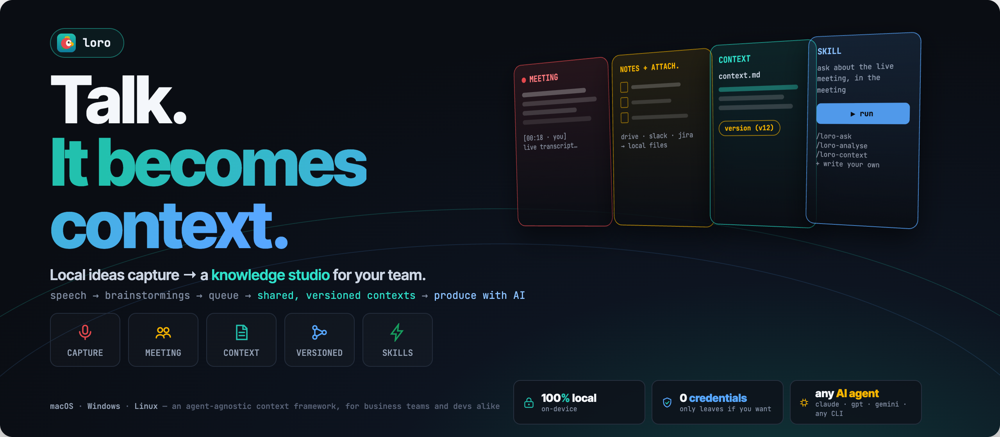

<div align="center">



# Loro 🦜

**Talk. It becomes context.**

A local, privacy-first knowledge studio: it transcribes your meetings and ideas
entirely on your machine, and distills them into versioned knowledge that both
people and AI agents can use as context.

[](https://github.com/aipi/loro/actions/workflows/ci.yml)
[](https://github.com/aipi/loro/releases)
[](LICENSE)


[Install](#install) · [How it works](#how-it-works) · [Documentation](#documentation) · [Contributing](#contributing)

</div>

---

## Why Loro

- **100% local transcription** — speech is transcribed on your machine with
  whisper.cpp. Raw audio never leaves the device; meeting audio is deleted as
  soon as it is transcribed.
- **Zero credentials** — Loro never asks for, stores, or logs a credential.
  Optional integrations (`git`, `gh`, your AI agent CLI) use your own ambient
  accounts.
- **Capture both sides of a meeting with no driver setup** — on macOS, meeting
  mode uses ScreenCaptureKit: one Screen Recording permission, no virtual audio
  driver, no admin rights.
- **Knowledge, not piles of transcripts** — an agent loop distills meetings,
  notes, and attached files into one `context.md` source of truth per topic,
  versioned in Git and evolved by pull request — with Git hidden behind two
  buttons ("Salvar versão" / "Enviar para revisão do time").
- **The review happens inside the app** — a **Revisão** destination shows what you
  changed, in plain language and then line by line, and the team's open reviews:
  read the description, the changed documents and the conversation, approve, ask
  for changes, reply, and merge into the official knowledge without leaving Loro
  or learning Git (ADR-0027).
- **Topics that point at each other** — a topic cites its neighbours with plain
  markdown links carrying the direction of the handoff. Those links *are* the
  graph: Loro computes the backlinks ("Citado por"), an index of every word the
  knowledge has written, and the list of topics nobody cites — **on read, never
  as a generated file**, so no derived index can drift from the markdown
  (ADR-0026).
- **Bring your own AI agent** — Loro wraps any AI agent CLI (`claude` by
  default, including local models) in an embedded terminal, and turns its
  skills into one-click actions. Nine ship built-in; you can author your own.
- **Portable by design** — the result is a self-contained context harness any
  agent or teammate can read. This repo documents itself in the same format.

## How it works

```
speech → brainstormings → queue → shared, versioned contexts → produce with AI
```

1. **Capture** — live transcription of mic, system audio, or both sides of a
   video meeting; as a desktop app (Tauri v2) and a CLI (`loro.sh`). See
   [capture modes](#capture-modes).
2. **Organize** — a VS Code-like workspace where you gather meetings, notes,
   and attachments per brainstorming, and pick the files that matter.
3. **Knowledge** — "transformar em conhecimento" runs an agent loop that files
   material by topic and proposes changes to each topic's `context.md` source
   of truth. Open questions live inline as *hotspots*; a person approves what
   becomes truth.
4. **Review** — the fourth destination: see your own change before you save a
   version of it, and read, discuss and approve the team's proposed changes in
   the app. Nothing enters the official knowledge without a person reading it, and
   the screen never claims more than it knows: a version keeps what is already in
   the file, so an unsaved editor buffer is named instead of hidden, and the team
   half says it is not connected *before* you click.

5. **Extend** — an **extension** is a local folder that can add a whole screen to
   Loro, built from what your project already knows, and may bring its own program
   (an MCP server over stdio) that Loro is the client of. Nothing is downloaded and
   nothing is built: the source is a directory on your machine. The program never
   runs by itself — you start and stop it, and it stops when Loro closes; the first
   start of a program this machine has not approved names the command and asks, and
   that answer stays on the machine instead of travelling with the project. A started
   program is not sandboxed: it runs with your own access, and the screen that asks
   says so. The screen
   is composed from a closed alphabet of primitives, so an extension asks for a role
   (`tone: "amber"`) and never for a measurement: both themes and both languages keep
   working, and no third-party byte reaches the network, the styles, or the focus
   order. Two worked examples live in
   [`examples/extensions/`](examples/extensions/) — one with no code at all.

The knowledge base (the **acervo**) lives in a folder you choose, separate from
the app. Ideas are cheap; context is earned: a context is production knowledge,
promoted after review — never a raw dump of everything said. The full product
philosophy is in [`brain/contexts/loro/context.md`](brain/contexts/loro/context.md).

## Install

### macOS (Apple Silicon)

```bash
brew tap aipi/loro
brew trust aipi/loro         # Homebrew 6+: trust this third-party tap, once per machine
brew install --cask loro     # installs Loro.app + whisper-cpp + ffmpeg
```

**First launch:** open **Settings (⚙) → model** and download the model you want
— `large-v3-turbo` (accurate) or `small` (fast). It is fetched to
`~/.loro/models`, verified by SHA-256. Then you are ready to transcribe.

> **Gatekeeper:** Loro is ad-hoc signed, not notarized, so macOS 15+ may claim
> the app is *"damaged"* and offer to move it to the Trash. It is not damaged —
> click **Cancel**, then clear the quarantine attribute once:
> `xattr -dr com.apple.quarantine /Applications/Loro.app`

<details>
<summary><strong>macOS troubleshooting</strong> (Homebrew 6+, non-admin installs)</summary>

| Error | Fix |
|---|---|
| `Refusing to load cask aipi/loro/loro from untrusted tap` | `brew trust aipi/loro` — Homebrew 6+ requires trusting a third-party tap once per machine |
| `invalid option: --no-quarantine` | that flag was removed in Homebrew 6.x; install normally, then run the `xattr -dr …` above if Gatekeeper complains |
| `… is not in the sudoers file` (install hangs on a password prompt) | you're a non-admin user and can't write `/Applications`; reinstall with `brew install --cask --appdir="$HOME/Applications" loro` |
| macOS says the app is "damaged" / offers **Move to Trash** | click **Cancel** (the app is ad-hoc signed, not damaged), then `xattr -dr com.apple.quarantine <path-to>/Loro.app` |

The unsigned `.dmg` is also attached to each
[GitHub Release](https://github.com/aipi/loro/releases) for a manual install.

</details>

### Windows (10/11, x64)

There is no prebuilt installer yet — you build from source once (about four
commands), and the app itself installs the transcription engine from a banner
on first run. Follow the **[Windows install guide](docs/install-windows.md)**.

### From source (macOS/Linux)

```bash
git clone https://github.com/aipi/loro.git && cd loro
./loro.sh setup     # install engine + download models to ~/.loro/models
./loro.sh app       # run the desktop app (dev)
```

<details>
<summary><strong>Requirements</strong> (what <code>loro.sh setup</code> checks and installs)</summary>

| Component | Purpose | How |
|---|---|---|
| **whisper-cpp** (`whisper-cli` + `whisper-stream`) | transcription engine (system dependency, never vendored) | `./loro.sh setup` (macOS: `brew install whisper-cpp`) · Windows: the in-app setup button builds it (ADR-0012) |
| **ffmpeg** | audio conversion/mixing | `./loro.sh setup` (Windows: `winget install Gyan.FFmpeg`) |
| **Node.js ≥ 18** + **Rust (rustup)** | desktop app (Tauri) | https://nodejs.org · https://rustup.rs |
| **Python ≥ 3.12** | diarization (optional) | — |
| **git** + **gh** | optional: knowledge versioning / remote collaboration | opt-in, validated by an in-app doctor |
| **AI agent CLI** (`claude` by default) | optional: the agent loop and meeting AI skills | runs in the embedded terminal, user's own account; configurable per acervo (any CLI, including local models — ADR-0003) |

Installed anywhere your own shell can find it is enough: an app opened from the
Dock inherits none of your PATH, so Loro establishes it at startup from your login
shell plus the usual install locations, and no PATH editing is asked of you
(ADR-0030). Install a tool while Loro is open and it is seen after a restart.

Models are ggml files under `~/.loro/models` (configurable via
`LORO_MODELS_DIR`); the desktop app downloads the model you pick on first use,
verified by SHA-256 (ADR-0006).

</details>

## Capture modes

| Mode | What it captures | Setup |
|---|---|---|
| **Live** | mic (`SOURCE=mic`) or system audio (`SOURCE=system`), streamed as you speak | mic: none · system: loopback driver — BlackHole on macOS (`./loro.sh sysaudio-setup`, needs admin), "Stereo Mix"/VB-Cable on Windows |
| **File** | the whole session, recorded then transcribed at once — more faithful than streaming | none |
| **Meeting** *(macOS only)* | your voice **and** the computer's audio — both sides of a Meet/Zoom call — via a ScreenCaptureKit sidecar | one Screen Recording permission; no virtual driver, no admin |

In meeting mode the transcript accretes live into the meeting's notebook, and
audio is transient — deleted once transcribed.

## Security & privacy

Security is a premise, enforced by immutable business rules with test coverage:

- **BR-1** — inference is 100% local by default; raw audio never leaves the
  machine under any circumstance. Anything external runs only on your explicit
  invocation, via your own agent.
- **BR-8** — logs are structured and content-free: no transcript text, no PII.
- **BR-9** — no credential is ever requested, stored or logged.
- **An extension's program is a peer, not a sandbox** — Loro states its trust
  boundary instead of simulating one: the program you install runs with your own
  access, nothing starts it but you, the command is named before the first run and
  approved per machine, and no extension gets a filesystem, exec or network API
  from Loro. A program that would hold audio can never also hold the network, and
  that one has no consent path.

See [`docs/adr/0001-baseline.md`](docs/adr/0001-baseline.md) §3 for the full
posture, and [`SECURITY.md`](SECURITY.md) for reporting vulnerabilities.

## Documentation

| Document | What it covers |
|---|---|
| [`brain/contexts/loro/context.md`](brain/contexts/loro/context.md) | What the product is and why — the source of truth, in Loro's own format |
| [`docs/ARCHITECTURE.md`](docs/ARCHITECTURE.md) | How it is built: contexts, IPC contract, flows |
| [`docs/adr/`](docs/adr/) | Technical decisions — `0001` is the consolidated baseline, `0002+` are incremental |
| [`desktop/README.md`](desktop/README.md) | The desktop app's UI details |
| [`examples/extensions/`](examples/extensions/) | Two working extensions and the contract an author writes against: a kanban of open points with **no code at all**, and a standard-library Python MCP server with its own protocol tests |
| In-app manual (pt/en) | "Como funciona o Loro", in the sidebar footer |

The app UI is pt-BR or English — chosen when you create an acervo, switchable
in Settings; generated content follows that language. All code and docs are in
English.

## Development

```bash
./loro.sh test      # test suite (Rust + JS)
./loro.sh doctor    # report the detected environment
make test · make lint · make build · make test-docker
```

On Windows the `Makefile` needs a POSIX shell — run the same checks in
PowerShell:

```powershell
cd desktop\src-tauri; cargo test
cd desktop; node --test tests/*.test.js
cargo clippy --manifest-path desktop/src-tauri/Cargo.toml -- -D warnings
```

## Contributing

Contributions are welcome — from humans and AI agents alike. Read
[`CONTRIBUTING.md`](CONTRIBUTING.md) for the workflow (TDD, Conventional
Commits, ADRs for non-trivial decisions) and [`CLAUDE.md`](CLAUDE.md) for how
to work in this codebase.

## License

[Apache-2.0](LICENSE)
